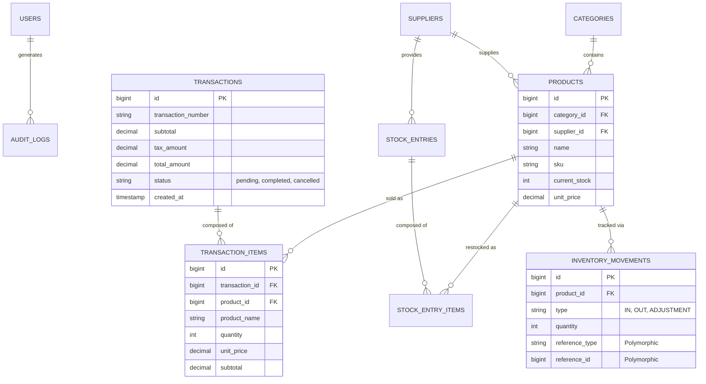

# PureVibe Kiosk: A Real-Time Self-Checkout and Inventory Management System
## Comprehensive Technical Documentation & Thesis Report

**Target Audience:** Academic Reviewers, Evaluating Professors, and Future Software Engineers

---

## Abstract

The **PureVibe Kiosk** is a modern, web-based self-checkout and administration system designed to streamline retail operations. This document serves as a comprehensive technical thesis, detailing the architectural decisions, database schema, module integrations, and the precise synchronous and asynchronous data flows that power the application. By leveraging the Model-View-Controller (MVC) paradigm, the system ensures high scalability, stringent data integrity, and a seamless user experience for both the customer and the store administrator.

---

## Chapter 1: Introduction

### 1.1 Project Background
In modern retail, efficiency and speed are paramount. Traditional cashier-operated systems often lead to bottlenecks during peak hours. The PureVibe Kiosk system was conceptualized to alleviate these bottlenecks by providing customers with an intuitive, touch-friendly self-checkout interface, while simultaneously providing store administrators with a real-time, bird's-eye view of transactions, inventory, and sales analytics.

### 1.2 Objectives
The primary objectives of this system are:
1. **Frictionless Checkout:** To provide an intuitive interface where customers can search, filter, and add items to a cart without staff assistance.
2. **Real-Time Synchronization:** To establish a seamless communication bridge between the customer-facing kiosk and the administrative dashboard using asynchronous polling.
3. **Absolute Data Integrity:** To ensure that inventory stock is strictly and accurately managed, preventing race conditions (e.g., two customers buying the last item simultaneously).
4. **Comprehensive Reporting:** To generate actionable analytics (daily sales, low stock alerts, top-selling products) based on completed transactions.

---

## Chapter 2: System Architecture & Technology Stack

The application is built upon a robust, decoupled architecture that separates the presentation logic from the business and data access layers.

### 2.1 Architectural Pattern: MVC (Model-View-Controller)
The system rigorously follows the MVC pattern:
- **Models:** Eloquent ORM (Object-Relational Mapping) classes that interact directly with the MySQL database. They encapsulate business logic, relationships (e.g., `Product belongsTo Category`), and mutators.
- **Views:** Blade templating engine files that generate dynamic HTML.
- **Controllers:** PHP classes that act as the middleman, receiving HTTP requests, querying the Models, and returning the appropriate View or JSON response.

### 2.2 Backend Technologies
- **Framework:** Laravel 11.x (PHP 8.2+)
- **Database:** MySQL / MariaDB
- **Security:** Laravel built-in CSRF (Cross-Site Request Forgery) protection, parameterized PDO queries to prevent SQL injection, and bcrypt password hashing.

### 2.3 Frontend Technologies
To ensure the Kiosk interface is highly performant and can run on lower-end hardware, heavy JavaScript frameworks (like React or Vue) were intentionally avoided.
- **Markup & Styling:** HTML5 and Vanilla CSS utilizing modern CSS variables and Glassmorphism aesthetics.
- **UI Framework:** Bootstrap 5.3 for responsive grid layouts and modal components.
- **Interactivity:** Vanilla JavaScript (ES6+). The Fetch API is utilized heavily for AJAX requests, allowing the kiosk to search products and poll transaction statuses without requiring full page reloads.

---

## Chapter 3: Database Design & Entity Relationship

Data integrity is the cornerstone of the PureVibe system. The database is highly normalized to eliminate data redundancy and ensure accurate reporting.

### 3.1 Entity Relationship Diagram (ERD)

### 3.2 Data Dictionary & Core Tables
1. **`users`**: Stores administrative credentials and roles.
2. **`products`**: The central catalog. Includes `current_stock` which acts as the real-time truth for inventory availability.
3. **`transactions`**: Records the overarching sale. Includes a unique `transaction_number`, financial totals, and a strict `status` flag (`pending` or `completed`).
4. **`transaction_items`**: The line-items of a transaction. *Crucial Design Choice:* This table copies the `unit_price` and `product_name` from the `products` table at the exact moment of sale. This ensures that historical receipts remain perfectly accurate even if the product's price or name is changed in the future.
5. **`inventory_movements`**: An immutable ledger. Every time stock goes up or down, a record is created here. It uses *Polymorphic Relations* (`reference_type` and `reference_id`) to point exactly to the Transaction or Stock Entry that caused the movement.
6. **`settings`**: A key-value store allowing the administrator to dynamically alter the store's Tax Rate, Store Name, and Receipt footers without altering the source code.

---

## Chapter 4: Module Specifications

### 4.1 The Kiosk Module
The customer-facing application operates as a pseudo-Single Page Application (SPA).
- **Dynamic Catalog:** Products are fetched via AJAX. When a user clicks a Category, JavaScript updates the DOM instantly without a page refresh.
- **Cart Management:** Managed entirely in the client's browser memory (RAM) via a JavaScript array. Subtotals and dynamic taxes are recalculated locally on every quantity adjustment.

### 4.2 The Administration Dashboard
A secure, authenticated portal for store managers.
- **Metric Aggregation:** The dashboard controller calculates `todaySales`, `weeklySales`, and `monthlySales` by dynamically querying the database with `SUM()` functions, strictly filtering for `status = 'completed'`.
- **Live Monitoring:** The dashboard utilizes an invisible JavaScript polling mechanism that pings the server every 5 seconds. If a new `pending` transaction is detected, it plays an auditory chime and refreshes the list, notifying the cashier/admin immediately.

---

## Chapter 5: Complete Application Process Flow

This section details the exact lifecycle of a purchase, highlighting the intricate handshakes between the frontend JavaScript and the backend PHP controllers.

### Phase 1: Initiation and Cart Population
1. **Initialization:** The Kiosk boots up, loading the base HTML layout. A JavaScript `fetch()` request is fired to `/kiosk/products`, returning a JSON payload of all active items with `current_stock > 0`.
2. **Interaction:** The user taps "Add to Cart". The item is pushed to the local JavaScript `cart` array. The UI dynamically updates the Subtotal and Tax strings (calculating against the global setting `default_tax_rate`).

### Phase 2: The Checkout Action
3. **Payload Submission:** The user taps "Checkout". A JSON payload containing the array of `product_ids` and their `quantities` is POSTed to the `KioskController@checkout` endpoint.
4. **Server-Side Validation:** The controller intercepts the payload. It verifies two things:
   - Does the product still exist?
   - Is the requested `quantity` less than or equal to the `current_stock`?
5. **Transaction Instantiation:** A parent `Transaction` record is inserted with the financial totals and a `status` of **`pending`**.
6. **Line-Item Creation:** Loop through the cart payload to create `TransactionItem` records linked to the parent transaction.
7. **Deferral of Stock Deduction:** *Critical Design Feature:* At this stage, physical stock (`current_stock`) is **NOT** deducted. The system simply queues the request.
8. **Response & Polling Initiation:** The server replies with a `200 OK` and the `transaction_id`. The Kiosk immediately displays a "Waiting for Admin Confirmation" modal and begins a background `setInterval` loop, querying `/kiosk/transaction/{id}/status` every 2 seconds.

### Phase 3: Administrative Verification
9. **Dashboard Alert:** The Kiosk's pending transaction surfaces on the Admin's `reports/transactions` screen via the 5-second auto-refresh script.
10. **Verification & Action:** The Admin visually verifies the customer has the correct physical items and clicks the **"Confirm"** button.
11. **The Execution Engine (`ReportController@confirmTransaction`):**
    - **Database Transaction Begins:** `DB::beginTransaction()` is called to ensure atomicity. If any step fails, the entire process rolls back, preventing data corruption.
    - **Pessimistic Locking:** A `SELECT ... FOR UPDATE` lock (`Product::lockForUpdate()`) is placed on the specific products being purchased. This prevents race conditions if another admin or kiosk attempts to manipulate the same stock simultaneously.
    - **Stock Deduction:** The `current_stock` of each product is mathematically decremented.
    - **Ledger Entry:** An `InventoryMovement` record of type `OUT` is generated.
    - **State Change:** The Transaction `status` is finalized to **`completed`**.
    - **Commit:** `DB::commit()` saves all changes permanently.

### Phase 4: Resolution
12. **Kiosk Awakening:** The Kiosk's next 2-second AJAX poll receives the new status: `completed`.
13. **Receipt Generation:** The JavaScript breaks the polling loop, closes the waiting modal, and dynamically renders the receipt modal. The receipt accurately displays the `tax_name` (e.g., "VAT" or "GST") and rates pulled directly from the `$settings` configuration.
14. **Reset:** Upon printing or dismissing the receipt, the Kiosk flushes the local `cart` array and resets for the next consumer.

---

## Chapter 6: Security & Data Integrity Highlights

For a system handling financial calculations and physical inventory, stringent safeguards were implemented:

1. **Double Validation:** The frontend prevents users from adding out-of-stock items, but the backend *also* mathematically verifies stock limits during checkout, mitigating API-level tampering.
2. **Pessimistic Database Locking:** Mentioned in Phase 3, locking prevents the classic concurrency flaw where two parallel requests read a stock level of `1`, both deduct `1`, and result in a stock level of `-1`.
3. **Atomic Operations:** By wrapping the confirmation logic in `DB::beginTransaction()` and `DB::commit()`, the system ensures that it will never deduct stock without also saving the completed transaction state. If the server crashes mid-process, the database safely rolls back to its original state.
4. **Data Immutability:** Historical transactions and receipts do not rely on relationships that can be altered. If a product is renamed or its price raised tomorrow, yesterday's receipts will still correctly display the old name and price via the isolated `transaction_items` table.

---

## Conclusion
The PureVibe Kiosk system represents a highly structured, enterprise-ready approach to retail automation. By decoupling the checkout intent from the inventory execution, implementing robust asynchronous communication, and enforcing strict relational database integrity, the software is well-equipped to handle high-traffic environments while providing pristine, accurate analytics to the administration.
