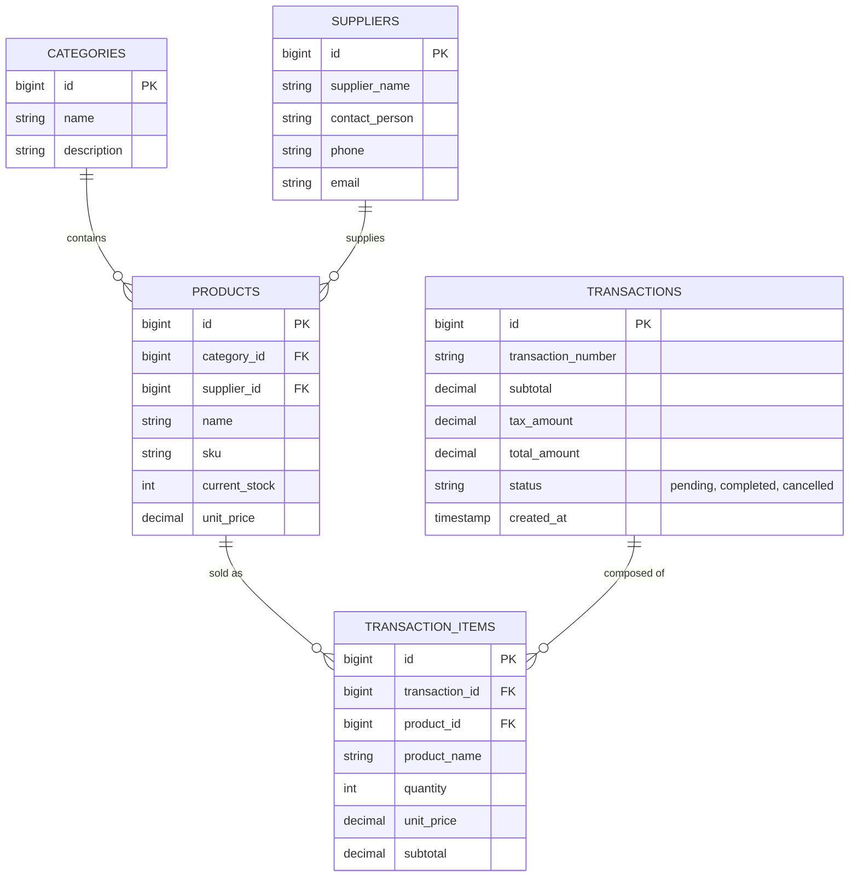

# DCIT 55A - Advanced Database Management System
## PureVibe System: Final Project Documentation (Lecture Track)

**Project Title:** PureVibe Kiosk - Database Architecture and Data Analysis
**Course:** DCIT 55A - Advanced Database Management System
**Instructor:** [Insert Instructor Name Here]

**Team Members:**
1. [Insert Leader Name Here]
2. [Insert Member Name Here]
3. [Insert Member Name Here]
4. [Insert Member Name Here]
5. [Insert Member Name Here]
6. [Insert Member Name Here]

---

## Chapter 1: Project Overview

### 1.1 System Description
The PureVibe Kiosk is a comprehensive web-based self-checkout and administration system designed to streamline retail operations. At its core, it relies on an advanced relational database management system to track inventory, handle sales transactions, manage product categories, and interact with supplier data.

### 1.2 Database Implementation Approach
This documentation proves our team's proficiency in advanced database management. While the system operates via a Laravel PHP application, this report explicitly extracts and demonstrates the **raw SQL capabilities** underlying the system, strictly adhering to the project rubric. We demonstrate table architecture, intentional data quality assessment, data cleaning operations, and advanced SQL querying (Filtering, Analysis, and JOINs).

---

## Chapter 2: Database Design & Entity Relationship

The database is designed to eliminate redundancy and maintain high data integrity.

### 2.1 Entity Relationship Diagram (ERD)



### 2.2 Core Table Structures

Below are the structural schemas of our primary tables.

*Table: products*
`product_id` (PK), `category_id` (FK), `supplier_id` (FK), `name`, `sku`, `current_stock`, `unit_price`, `created_at`

*Table: transactions*
`id` (PK), `transaction_number`, `subtotal`, `tax_amount`, `total_amount`, `status`

---

## Chapter 3: Data Quality Assessment (Phase 2)

Prior to running analytics, we populated the database with a dataset of 60+ products and 15 transactions containing intentional inconsistencies to simulate real-world data problems.

### 3.1 Documented Issues
1. **Inconsistent Casing:** The `categories` table contains incorrectly cased names (e.g., "eLeCtrOnIcs", "bEvErAgEs").
2. **Missing Pricing (NULLs):** Several rows in the `products` table have a `NULL` `unit_price`.
3. **Invalid Inventory:** The `products` table contains negative `current_stock` values.
4. **Duplicate Entries:** Duplicate product SKUs exist in the database.
5. **Missing Contact Info:** `suppliers` table has `NULL` phone numbers.

### 3.2 Evidence of Dirty Data
To identify these issues, we executed the following assessment query:

**Query:**
```sql
SELECT id, name, unit_price, current_stock 
FROM products 
WHERE unit_price IS NULL OR current_stock < 0;
```

**[INSERT SCREENSHOT HERE: Result of Assessment Query showing NULL prices and negative stock]**

---

## Chapter 4: Data Cleaning Operations (Phase 3)

We utilized advanced SQL `UPDATE` and `DELETE` commands to sanitize the data. We executed these directly inside our PureVibe Academic SQL Runner.

### 4.1 Standardizing Formatting
**Action:** Fix category names to title case/proper capitalization.
```sql
UPDATE categories 
SET name = CONCAT(UPPER(SUBSTRING(name, 1, 1)), LOWER(SUBSTRING(name, 2)));
```
**[INSERT SCREENSHOT HERE: SQL Runner showing "Before" and "After" state of the category names]**

### 4.2 Handling NULL Values
**Action:** Set all `NULL` prices in the products table to a default value of `0.00`.
```sql
UPDATE products 
SET unit_price = 0.00 
WHERE unit_price IS NULL;
```
**[INSERT SCREENSHOT HERE: SQL Runner showing "Before" and "After" modification of prices]**

### 4.3 Fixing Invalid Data
**Action:** Reset all negative inventory stock back to `0`.
```sql
UPDATE products 
SET current_stock = 0 
WHERE current_stock < 0;
```

### 4.4 Removing Duplicates
**Action:** Delete duplicate product records to maintain SKU uniqueness.
```sql
DELETE FROM products 
WHERE id NOT IN (
    SELECT min_id FROM (
        SELECT MIN(id) as min_id FROM products GROUP BY sku
    ) as temp_table
);
```

---

## Chapter 5: Data Filtering Operations (Phase 4)

With the database cleaned, we executed strictly formulated SQL filtering queries.

### Query 1: The `WHERE` Clause (Low Stock Identification)
*Identifies items that urgently need restocking.*
```sql
SELECT id, name, sku, current_stock 
FROM products 
WHERE current_stock < 20;
```
**[INSERT SCREENSHOT HERE: Result of Query 1]**

### Query 2: The `BETWEEN` Operator (Price Range Filtering)
*Finds mid-tier products priced between 50 and 500.*
```sql
SELECT name, unit_price 
FROM products 
WHERE unit_price BETWEEN 50.00 AND 500.00;
```
**[INSERT SCREENSHOT HERE: Result of Query 2]**

### Query 3: The `LIKE` Operator (Text Pattern Matching)
*Locates any supplier containing 'Co' in their name (e.g., CleanCo, Fresh Farms Co., BeautyBasics).*
```sql
SELECT id, name as supplier_name, email 
FROM suppliers 
WHERE name LIKE '%Co%';
```
**[INSERT SCREENSHOT HERE: Result of Query 3]**

### Query 4: The `IN` Clause (Targeted Selection)
*Filters products that belong to specific Category IDs.*
```sql
SELECT name, category_id, unit_price 
FROM products 
WHERE category_id IN (1, 3, 5);
```
**[INSERT SCREENSHOT HERE: Result of Query 4]**

### Query 5: The `ORDER BY` Clause (Top Stocked Items)
*Retrieves the top 10 products with the highest inventory.*
```sql
SELECT name, current_stock 
FROM products 
ORDER BY current_stock DESC 
LIMIT 10;
```
**[INSERT SCREENSHOT HERE: Result of Query 5]**

---

## Chapter 6: Data Analysis & Aggregation (Phase 5)

These queries extract meaningful business intelligence using aggregate functions.

### Analysis 1: The `COUNT` Function
*Counts the total number of products supplied by each supplier.*
```sql
SELECT supplier_id, COUNT(*) as total_products_supplied 
FROM products 
GROUP BY supplier_id;
```
**[INSERT SCREENSHOT HERE: Result of Analysis 1]**

### Analysis 2: The `SUM` Function
*Calculates the total financial value of all current stock in the store.*
```sql
SELECT SUM(current_stock * unit_price) as total_inventory_valuation 
FROM products;
```
**[INSERT SCREENSHOT HERE: Result of Analysis 2]**

### Analysis 3: The `AVG` Function
*Determines the average price of products within each category.*
```sql
SELECT category_id, AVG(unit_price) as average_category_price 
FROM products 
GROUP BY category_id;
```
**[INSERT SCREENSHOT HERE: Result of Analysis 3]**

### Analysis 4: `GROUP BY` with `HAVING`
*Finds categories that have more than 3 active products.*
```sql
SELECT category_id, COUNT(*) as product_count 
FROM products 
GROUP BY category_id 
HAVING product_count > 3;
```
**[INSERT SCREENSHOT HERE: Result of Analysis 4]**

### Analysis 5: Multiple Aggregates
*Comprehensive summary of transaction financials.*
```sql
SELECT 
    COUNT(id) as total_transactions,
    SUM(total_amount) as gross_revenue,
    AVG(total_amount) as average_order_value,
    MAX(total_amount) as highest_sale
FROM transactions 
WHERE status = 'completed';
```
**[INSERT SCREENSHOT HERE: Result of Analysis 5]**

---

## Chapter 7: Advanced Data Joining (Phase 6)

To fully utilize the relational nature of our schema, we performed complex `JOIN` operations.

### Join Query 1: `INNER JOIN` (Product and Category Names)
*Combines products with their human-readable category and supplier names.*
```sql
SELECT 
    p.name as product_name, 
    c.name as category_name, 
    s.name as supplier_name 
FROM products p
INNER JOIN categories c ON p.category_id = c.id
INNER JOIN suppliers s ON p.supplier_id = s.id
LIMIT 15;
```
**[INSERT SCREENSHOT HERE: Result of Join Query 1]**

### Join Query 2: Multi-Table Transaction Receipt Generation
*A comprehensive 3-table join that reconstructs a full transaction receipt.*
```sql
SELECT 
    t.transaction_number,
    t.created_at,
    ti.product_name,
    ti.quantity,
    ti.subtotal,
    t.total_amount
FROM transactions t
INNER JOIN transaction_items ti ON t.id = ti.transaction_id
WHERE t.status = 'completed'
ORDER BY t.created_at DESC
LIMIT 20;
```
**[INSERT SCREENSHOT HERE: Result of Join Query 2]**

---

## Conclusion
Through the development of the PureVibe system and the execution of this academic SQL exercise, our team successfully demonstrated proficiency in database normalization, data sanitization, and the extraction of vital business metrics using standard and advanced MySQL syntax. The integrated SQL Runner tool proves our application's direct interaction with the underlying relational database management system.
